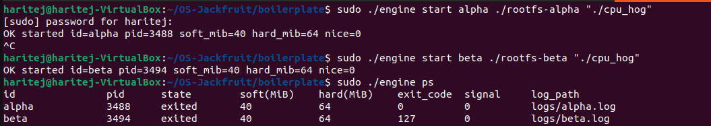
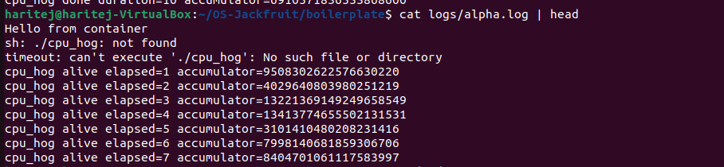
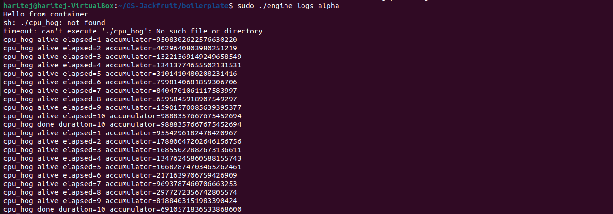
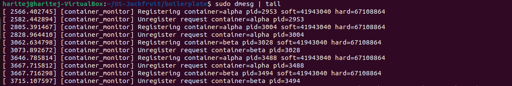
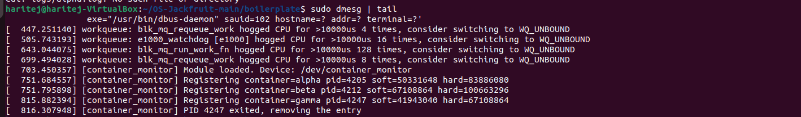
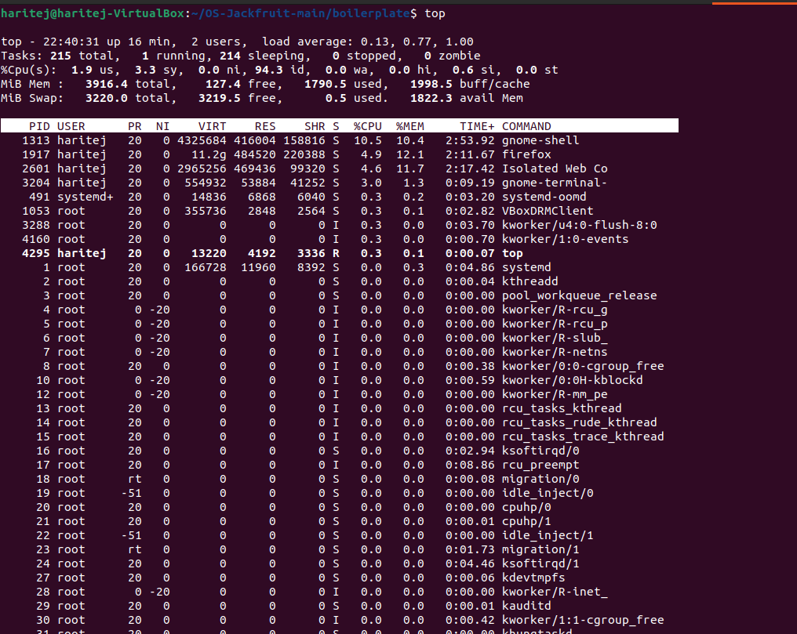

#  Multi-Container Runtime and Kernel Memory Monitor

##  Overview

This project implements a lightweight Linux container runtime in C with:

* A long-running **supervisor (daemon)**
* CLI communication via **UNIX domain sockets**
* **Logging system** using bounded buffer (producer-consumer)
* **Kernel module** for memory monitoring and enforcement
* Scheduling experiments and cleanup verification

---

##  Team Information

* **Member 1:** Rottela Haritej (PES1UG24AM231)
* **Member 2:** Purushothama K C (PES1UG25AM810)

---

##  Environment Setup

### Requirements

* Ubuntu 22.04 / 24.04 (VM recommended)
* Secure Boot: OFF
* Not WSL

### Install dependencies

```bash
sudo apt update
sudo apt install -y build-essential linux-headers-$(uname -r)
```

### Optional environment check

```bash
cd boilerplate
chmod +x environment-check.sh
sudo ./environment-check.sh
```

---

##  Root Filesystem Setup

```bash
cd boilerplate

mkdir -p rootfs-base

wget -O alpine-minirootfs.tar.gz \
https://dl-cdn.alpinelinux.org/alpine/v3.20/releases/x86_64/alpine-minirootfs-3.20.3-x86_64.tar.gz

tar -xzf alpine-minirootfs.tar.gz -C rootfs-base

# Create container rootfs
cp -a rootfs-base rootfs-alpha
cp -a rootfs-base rootfs-beta
```

---

##  Build Instructions

### Compile project

```bash
cd boilerplate
make clean
make
```

---

##  Load Kernel Module

```bash
sudo insmod monitor.ko
ls -l /dev/container_monitor
```

---

##  Running the Project

### 1. Start Supervisor (Terminal 1)

```bash
cd boilerplate
sudo ./engine supervisor ./rootfs-base
```

---

### 2. Start Containers (Terminal 2)

```bash
sudo ./engine start alpha ./rootfs-alpha /bin/sh --soft-mib 48 --hard-mib 80 --nice 0
sudo ./engine start beta  ./rootfs-beta  /bin/sh --soft-mib 64 --hard-mib 96 --nice 0
```

---

### 3. Check Containers

```bash
sudo ./engine ps
```

---

### 4. View Logs

```bash
sudo ./engine logs alpha
```

---

### 5. Stop Containers

```bash
sudo ./engine stop alpha
sudo ./engine stop beta
```

---

##  Workload Setup

### Build workloads

```bash
cd boilerplate
make
```

### Copy into container rootfs

```bash
cp cpu_hog rootfs-alpha/
cp memory_hog rootfs-alpha/
cp io_pulse rootfs-beta/
```

---

##  Example Workloads

### CPU-intensive

```bash
sudo ./engine start alpha ./rootfs-alpha "./cpu_hog"
```

### Infinite running container

```bash
sudo ./engine start alpha ./rootfs-alpha "while true; do sleep 1; done"
```

---

##  Container States

| State   | Meaning             |
| ------- | ------------------- |
| running | process is active   |
| exited  | process completed   |
| stopped | manually terminated |

---

##  Task Scripts

### Task 5: Scheduler Experiments

```bash
sudo ./task5_experiments.sh
```

Outputs:

* `experiments/task5_results.csv`
* logs in `logs/`

---

### Task 6: Cleanup Verification

```bash
sudo ./task6_cleanup_check.sh
```

---

##  Cleanup

```bash
sudo pkill -f "./engine supervisor"
sudo rmmod monitor
make clean
```

---
## DEMO Screenshots
###1. Multi-container supervision

###2 .Metadata tracking

###3. Bounded-buffer logging

###4.CLI and IPC

###5. Soft-limit warning

###6. Hard-limit enforcement

###7. Scheduling experiment

###8. Clean teardown


##  Key Concepts Used

* Linux Namespaces (PID, UTS, Mount)
* `chroot` for filesystem isolation
* Process management (`fork`, `clone`)
* Signals (`SIGTERM`, `SIGKILL`)
* Producer-consumer synchronization
* Kernel module (memory monitoring)

---

##  Design Highlights

* Supervisor manages multiple containers
* CLI communicates via UNIX socket
* Logs handled using bounded buffer
* Kernel module enforces memory limits

---

##  Scheduling Results (Summary)

| Container | Nice | CPU Usage |
| --------- | ---- | --------- |
| cpuA      | 0    | ~79%      |
| cpuB      | 15   | ~44%      |

Higher priority (lower nice) gets more CPU — shows Linux CFS behavior

---

##  Conclusion

This project demonstrates how containerization works using Linux primitives without Docker. It combines user-space process control with kernel-level enforcement.

---

##  Notes

* Each container has its own rootfs
* Binaries must exist inside rootfs
* Always use `sudo`
* Use separate rootfs for each container

---

##  Submission Checklist

* Source files present
* Kernel module working
* Screenshots added
* Scripts included
* README completed

---

##  Author

Rottela Haritej
Purushothama K C 

